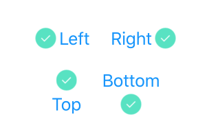

# SeamgenKit

[](https://swift.org)

SeamgenKit provides a set of extension methods and helper classes for making iOS development using Swift easier.

Other great Cocoapods:

* [SwiftDate](https://cocoapods.org/pods/SwiftDate) - Date utilities


## Requirements

iOS 9.3 or later.

## Installation

SeamgenKit is available through [CocoaPods](http://cocoapods.org). To install
it, simply add the following line to your Podfile:

```ruby
pod 'SeamgenKit', :git => 'https://github.com/seamgen/SeamgenKit-Swift.git'
```

## Usage

### ConfigurableOnInit(WithFrame)

Objects confroming to this protocol can be customized at initialization time.  The only requirements is that a class must implement `init()` or `init(frame: CGRect)`.  UIView and NSObject conform to this protocol by default.

```swift
let label = UILabel(frame: .zero) { 
	$0.text = "Hello World"
	$0.textAlignment = .center
}

let stackView = UIStackView {
    $0.addArrangedSubview(label)
}
```

### ImageAdjustableButton

A UIButton subclass that allows positioning of the image view relative to the title label.




### APNSToken

A wrapper for converting a remote notification device token to a string representation:

```swift
class AppDelegate {
	func application(_ application: UIApplication, didRegisterForRemoteNotificationsWithDeviceToken deviceToken: Data) {
		let token = APNSToken(deviceToken)
		print(token.string) // prints "790bc691 eea10194 d80cea25 49d2d8ec 0fb439d1 54242532 db4edecf 97f9e092"
		print(token.data) // prints "32 bytes"
 	}
 }

```

### Bool

Convert to `String` and `Int` values:

```swift
// To Int:
true.intValue	// returns 1
false.intValue	// returns 0

// To String:
true.stringValue()	// returns "true"
false.stringValue()	// returns "false"

// in a specific format:
true.stringValue(as: .yesNo)	// returns "yes"
false.stringValue(as: .yN)	// returns "n"
```

Or specify your own formats:

```swift
extension BoolStringFormatter {
	/// Custom "yep" or "nope" formatter.
	static let yepNope = BoolStringFormatter(t: "yep", f: "nope")
}

true.stringValue(as: .yepNope)	// returns "yep"
false.stringValue(as: .yepNope)	// returns "nope"
```


### CGSize

Scale sizes while maintaing aspect ratio:

```swift
let size = CGSize(width: 100, height: 50)

let fit = size.scaledTo(fit: CGSize(width: 50, height: 50)) // returns { w: 50, h: 25 }
let fill = size.scaledTo(fill: CGSize(width: 100, height: 100) // returns { w: 200, h: 100 }
```


### DispatchTime

Simplify delayed async dispatch by making `DispatchTime` conform to `ExpressibleByIntegerLiteral` and `ExpressibleByFloatLiteral`

```swift
DispatchQueue.main.asyncAfter(deadline: 5) { ... } // Executes after 5 seconds.
```


### Floating Point

Convert any `FloatingPoint` value to and from radians and degrees:

```Swift
let radians = 90.0.degreesToRadians // returns 1.5707
let degrees = Double.pi.radiansToDegrees // returns 180
```


### MKMapSnapshot

Generate a map image with a pin annotation at a given coordinate:

```swift
let snapshot = MKMapSnapshot(...)
let coord = CLLocationCoordinate2D(33.132, -117.123)

// Creats the image from the snapshot with the pin annotation at the coordinate.
let image = snapshot.imageWithAnnotation(atCoordinate: coord)
```


### NSLayoutConstraint

Constants have been defined for `UILayoutPriority`:

```swift
/// Use this:
constraint.priority = .high

// instead of:
constraint.priority = UILayoutPriorityDefaultHigh
```

Adjust the priority of a constraint inline using `withPriority(_:)`:

```swift
button.leftAnchor.constraint(equalTo: view.leftAnchor).withPriority(.required).isActive = true
```

Activate a constraint inline using `activated()`:

```swift
// Assigns and activates the constraint simultaneously:
self.constraint = button.leftAnchor.constraint(equalTo: view.leftAnchor).activated()

// instad of:
let constraint = button.leftAnchor.constraint(equalTo: view.leftAnchor)
constraint.isActive = true
self.constraint = constraint
```


### String

Value conversion from `String` to `Int`, `Double`, `Float`:

```swift
"100".intValue	// returns 100
"Foo".intValue	// returns 0
"".intValue		// returns 0
```

and to `Bool`.  Any number greater than 0 will return true.

```swift
// Numbers > 0 return true.
"0".boolValue 	// returns false
"1".boolValue 	// returns true
"5".boolValue 	// returns true

// Case insensitive
"TRue".boolValue 	// returns true
"true".boolValue 	// returns true
"yes".boolValue		// returns true
"y".boolValue 		// returns true

// All other values return false.
```

Checking the contents of the string:

```swift
"Abc123".containsNumbers 	// returns true
"Abc123".containsLetters 	// returns true
"Abc123".isAlphaNumeric		// returns true

"Abc123".isNumeric		// returns false
"Abc123".isAlphabetic	// returns false

"123".isNumeric		// returns true
"Abc".isAlphabetic	// returns true

"Abc123".numbers	// returns "123"

let set = CharacterSet(charactersIn: "bc")
"Abc123".includingCharactersIn(set)	// returns "bc"
```


### Table/Collection Views

There are convenience methods on `UITableView` and `UICollectionView` that simplify registration and dequeueing of cells and supplementary views using the `ReusableView` protocol.

The old way:

```swift
class Cell: UITableViewCell { }
class Header: UITableViewHeaderFooterView { }

tableView.register(Cell.self, forCellReuseIdentifier: "cell")
tableView.register(Header.self, forHeaderFooterViewReuseIdentifier: "header")

let cell = tableView.dequeueReusableCell(withIdentifier: "cell", for: indexPath) as! Cell
let header = tableView.dequeueReusableHeaderFooterView(withIdentifier: "header") as! Header
```

The easier way:

```swift
// Conform to ReusableView
class Cell: UITableViewCell, ReusableView { }
class Header: UITableViewHeaderFooterView, ReusableView { }

tableView.register(Cell)
tableView.register(Header)

let cell: Cell = tableView.dequeueCell(for: indexPath)
let header: Header = tableView.dequeueView()
```


### TouchID

Use `UIDevice.current` to access TouchID helper methods.

To check if TouchID is available:

```swift
let result = UIDevice.current.isTouchIDAvailable
```


To prompt for TouchID authentication:

```swift
import LocalAuthentication

UIDevice.current.authenticateWithTouchID("Log In") { success, error in
    if let error = error as? LAError {
        switch error.code {
        case .userCancel:
   		     // Handle user cancellation.
            break
        default:
	        // Handle other error types.
            break
        }
    }
    
    // Handle success
}
```


### UIApplication

Provides a number of properties for getting information about the current application:

```swift
UIApplication.shared.displayName	// "My Great App"
UIApplication.shared.version	// "1.0"
UIApplication.shared.buildNumber	// "33"
UIApplication.shared.bundleIdentifier	// "com.seamgen.myGreatApp"

UIApplication.shared.isATSEnabled
// true if ATS has not been explicitly disable in the info.plist
```

And provides an easy way to launch the Settings.app by calling:

```swift
UIApplication.shared.launchSettingsApp()
```


### UIActivityIndicatorView

Convenience property for starting/stopping animation:

```swift
let loadingIndicator = UIActivityIndicatorView()

// Use:
loadingIndicator.animate = self.isLoading

// Instead of:
if self.isLoading {
	loadingIndicator.startAnimating()
} else {
	loadingIndicator.stopAnimating()
}
```


### UIButton

Convenience properties for setting common values for `UIControlState.normal`:

```swift
let button = UIButton()
button.title = "Submit"
button.titleColor = .red
button.attributedTitle = NSAttributedString(...)
button.image = UIImage(...)
```


### UIColor

Create colors from RGBA values or HEX strings:

```swift
let rgbColor = UIColor(r: 255, g: 255, b: 255, alpha: 1.0)
let hexColor = UIColor(hex: "#FFF")
let hexColor = UIColor(hex: "#FF00FF") // RGB
let hexColor = UIColor(hex: "#FF00FF55") // RGBA
```
 

### UIImage

Create a UIImage from a color:

```swift
let image = UIImage(color: .red) // returns a 1x1 pixel red image.
let image = UIImage(color: .red, size: CGSize(width: 100, height: 100)) // returns a 100x100

// More options: 
let image = UIImage(color: .red, 
					borderColor: .blue, borderWidth: 2, 
					cornerRadius: 8, corners: nil,
					size: CGSize(width: 100, height: 100))
```

Save an image to disk (as a JPEG)

```swift
let image = UIImage(...)
let url = URL(...)

image.writeJPEG(to: url)
```

Scaling

```swift
let image = UIImage(...)
let newSize = CGSize(width: 100, height: 100)

// Scale the image to 100x100 without maintaining the aspect ratio.
image.scaledTo(size: newSize)

// Produce an image where both dimensions are < 100.  Aspect is maintained.
image.scaledTo(fitSize: newSize)

// Produce an image where the smallest dimension is == 100.  Aspect is maintained.
image.scaledTo(fillSize: newSize)
```

Rotation

```swift
let image = UIImage(...)

image.rotated(.left) // Rotates the image -90°
image.rotated(.right) // Rotates the image 90°
image.rotated(.byDegrees(30)) // Rotates the image 30°
image.rotated(.byRadians(.pi)) // Rotates the image 180°
```

Fill an image with a color.  This method uses the alpha channel as a mask.  The result is similar to tinting a template image in a `UIImageView`.

```swift
let image = UIImage(...)
image.filled(with: .red)
```


### UIView / UIStack View

Add multiple subviews in one line of code:

```swift
let v1 = UIView()
let v2 = UIView()
let v3 = UIView()
let viewsToAdd = [v1, v2, v3]

let view = UIView()
let stack = UIStackView()

// Variadic:
view.addSubviews(v1, v2, v3)
stack.addArrangedSubviews(v1, v2, v3)

// or via an array:
view.addSubviews(viewsToAdd)
stack.addArrangedSubviews(viewsToAdd)
```


### UIViewController / Alerts

Methods for presenting basic alerts to the user:

```swift
// Display a localized error message to the user with an 'OK' button:
self.presentAlert(withError: error)
self.presentAlert(withError: error, title: "Uh-oh", defaultButtonTitle: "Got It")

// Display a generic alert with a title, message, and button:
self.presentAlert(withTitle: "Account Deleted")
self.presentAlert(withTitle: "Account Deleted", message: "Your account has been deleted.")
self.presentAlert(withTitle: "Account Deleted", message: "Your account has been deleted.", defaultButtonTitle: "OK")

// Present an alert that executes an action when dismissed:
self.presentAlert(withTitle: "Account Deleted", message: nil, defaultButtonTitle: nil) {
	// Handle OK button tapped.
}
```

Or present a "Not Implemented" alert to the user if work has not been completed:

```swift
// Generic alert:
self.presentNotImplementedAlert()

// More information:
self.presentNotImplementedAlert("Will be implemented in JIRA-12")
```


### URL

Methods for creating URLs that launch the native OS applications for phone, email, sms, and maps:

```swift
// Dial a phone number:
if let url = URL(phoneCallTo: "760-555-1212")  {
	UIApplication.shared.openURL(url)	// Initiates a phone call.
}

// Compose an Email
if let url = URL(emailTo: "devs@seamgen.com", subject: "SeamgenKit", body: nil, cc: nil) {
	UIApplication.shared.openURL(url) // Launches Mail.app
}

// Compose an SMS
if let url = URL(smsTo: "760-555-1212") {
	UIApplication.shared.openURL(url) // Launches Messages.app
}
```

Or use the `MapURLBuilder` for launching the native Maps app:

```swift
// View an address:
let url = MapURLBuilder(address: "123 Fake Street San Diego CA, 92101").url

// Execute a search query:
let url = MapURLBuilder(searchFor: "Italian Food").url

// Mark a location with a pin:
let coord = CLLocationCoordinate2D(33.132, -117.123)
let url = MapURLBuilder(pinAt: coord, label: "Seamgen Office"

// Get directions from your current location:
let url = MapURLBuilder(directionsTo: "123 Fake Street", from: nil, transportType: .drive).url
```

`UIApplication` also has convenience methods for creating and opening these URLs immediately:

```swift
UIApplication.shared.dial("760-555-1212")
UIApplication.shared.composeSMS(to: "760-555-1212")
UIApplication.composeEmail(to: "devs@seamgen.com")
```

## Author

Sam Gerardi, sgerardi@seamgen.com

## License

SeamgenKit is available under the MIT license. See the LICENSE file for more info.
